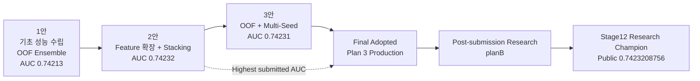

<div align="center">

# 🧬 Fertility PSP

### 난임 환자 대상 임신 성공 여부 예측 AI 프로젝트

<p>
  
  
  
  
  
</p>

**난임 시술 데이터의 구조적 결측과 임상적 feature를 해석하고,  
OOF·앙상블·Multi-Seed 검증을 거쳐 최종 Production 전략을 선택한 팀 프로젝트입니다.**

</div>

---

> **Canonical history aligned · 2026-08-08**  
> 이번 정리는 당시 팀이 실제 제출한 Notebook과 최종 발표자료를 기준으로 프로젝트 계보를 다시 맞춘 것입니다.  
> **최고 제출 AUC는 2안 `0.74232`, 최종 채택 Production 모델은 3안 `0.74231`입니다.**  
> 이후 만들어진 v6.x 계열과 `planB` 연구는 가치 있는 후속 연구이지만, 실제 최종 제출 당시의 역사와 분리해 기록합니다.

---

## 🏆 Final Result

| 항목 | 결과 |
|---|---:|
| 문제 | 난임 환자 임신 성공 여부 예측 |
| 평가 지표 | ROC-AUC — 높을수록 우수 |
| 최고 제출 모델 | **2안 — Ensemble / Stacking 확장** |
| 최고 제출 AUC | **0.74232** |
| 최종 채택 모델 | **3안 — OOF + Multi-Seed 기반 일반화** |
| 최종 채택 AUC | **0.74231** |
| 최종 판단 | 성능·안정성·복잡도·운영 효율의 균형을 고려한 Production 선택 |

### 왜 최고점 2안이 아니라 3안을 최종 채택했나

2안은 제출 점수 기준으로 가장 높았습니다. 하지만 최종 발표에서는 다음 요소를 함께 고려해 3안을 Production 모델로 선택했습니다.

- stacking 구조와 meta model의 복잡도
- leakage / overfitting 관리 부담
- 단계별 교차검증 비용
- 모델 결합에 따른 해석 난이도
- 추론 latency와 연산 자원
- split / seed 변화에 따른 점수 변동 가능성
- 실제 서비스 확장 시 운영 단순성

```text
Highest submitted AUC : Plan 2 — 0.74232
Final adopted model   : Plan 3 — 0.74231
```

---

## 🧬 Model Lineage



> **중요:** `planB`의 Stage12 champion은 공식 발표 이후의 후속 연구 계보입니다.  
> 점수가 비슷하더라도 실험 계약과 계보가 다르므로 공식 2안/3안과 동일 모델이라고 단정하지 않습니다.

자세한 계보와 판단 근거는 [`docs/model_lineage.md`](docs/model_lineage.md)에 정리했습니다.

---

## 🔬 What We Learned

### 1. 결측은 단순한 누락이 아니었습니다

이 데이터에서는 DI 시술에서 배아·난자·이식 관련 정보가 대규모로 함께 비는 패턴이 확인되었습니다.

실제 제출 연구에서는 이 현상을 단순 NaN이 아니라 **시술 과정 자체가 존재하지 않아 발생하는 구조적 결측**으로 해석했습니다.

```text
IVF → embryo-related process exists
DI  → many embryo-related fields are structurally not applicable
```

그래서 모든 결측을 무조건 평균이나 0으로 덮는 대신, 원래 NaN의 의미를 보존하면서 필요한 missing flag를 함께 사용했습니다.

### 2. Domain-aware Feature Engineering

대표적인 feature 축은 다음과 같습니다.

| Feature group | 예시 | 목적 |
|---|---|---|
| 연령 | age ordinal, 38+/40+/43+ | 연령 증가에 따른 성공률 차이 반영 |
| 시술 유형 | IVF / DI / ICSI / BLASTOCYST token | 시술 구조 차이 반영 |
| 배아·난자 | 생성·이식·저장 배아 수, 난자 수 | 시술 과정의 핵심 수량 신호 |
| 비율 | fertilization / utilization ratio | 절대 개수보다 과정 효율 표현 |
| 경과일 | 배아 이식 경과일 등 | 발달·이식 시점 정보 |
| 기증자 | 난자 출처, donor age interaction | 기증 난자 맥락 반영 |
| 과거 이력 | 총 시술·임신·출산 횟수 | 이전 치료 경험 반영 |
| 조합 | age × oocyte source, treatment × day | 단일 변수보다 강한 상호작용 탐색 |

### 3. OOF를 중심으로 모델을 비교했습니다

단일 hold-out 점수만으로 후보를 고르지 않고 **K-Fold OOF** 예측을 사용해 모델과 앙상블을 비교했습니다.

### 4. 서로 다른 모델의 오류 패턴을 활용했습니다

주요 모델:

```text
CatBoost
LightGBM
XGBoost
```

대표 결합 전략:

```text
Weighted Ensemble
Rank Ensemble
Multi-Seed Ensemble
Stacking
```

Rank 계열은 ROC-AUC에는 유리할 수 있지만 예측값이 실제 확률보다 순위에 가까워져 LogLoss가 나빠질 수 있다는 점도 함께 확인했습니다.

---

## 📊 Final Presentation Comparison

| 실험안 | 전략 요약 | 내부 OOF AUC | 제출 AUC | 역할 |
|---|---|---:|---:|---|
| **1안** | 주요 boosting 모델 비교 + OOF ensemble | ≈ `0.74058` | `0.74213` | 기초 성능 수립 |
| **2안** | richer feature + weighted ensemble / stacking | ≈ `0.74088` | **`0.74232`** | 최고점 / upper-bound benchmark |
| **3안** | OOF + Multi-Seed 일반화 및 안정화 | ≈ `0.74060` | `0.74231` | **최종 Production 선택** |

OOF 값은 발표 당시 각 실험안의 내부 검증 계약에 따른 값이므로 아주 작은 차이를 동일한 조건의 직접 순위처럼 해석하지 않습니다.

---

## 📦 Canonical Final Submission Artifacts

2026-08-08에 팀이 직접 제공한 **실제 최종 제출 파일**을 기준으로 SHA-256과 Git blob SHA를 기록했습니다.

👉 [`deliverables/final_submission/MANIFEST.md`](deliverables/final_submission/MANIFEST.md)

핵심 파일:

```text
00.Project_Fertility_PSP_v5.ipynb
01_EDA_basic.ipynb
02_preprocessing_baseline.ipynb
03_rank1_strategy_local.ipynb
04_modeling_AUC_v3.ipynb
(예측모델_결과물)_조안_Project_Fertility_PSP_v5.ipynb
(발표자료)난임_환자_대상_임신_성공_여부_예측_AI_프로젝트-v4.pdf
```

### ⚠️ 동일 파일명 주의

현재 GitHub 루트의 `00.Project_Fertility_PSP_v5.ipynb`와 팀이 직접 제공한 최종 제출본은 **Git blob SHA가 다릅니다.**

```text
GitHub root historical file
  e6eec0a6512bfa20fca2b9a4eaf700d1b5cdad87

Team-supplied canonical final artifact
  97b1d34ed14e7e5f07ba1d25a07dd7d310faaf23
```

따라서 이름만 같다는 이유로 같은 버전으로 취급하지 않습니다.

이번 정리에서는 역사 자료를 성급히 삭제하거나 덮어쓰지 않고 먼저 **정확한 artifact identity와 계보를 고정**했습니다.

---

## 🧪 Rank-1 Local Workflow

실제 제출 세트의 `03_rank1_strategy_local.ipynb`는 로컬 독립 실행을 위한 구조를 이미 갖추고 있습니다.

```text
quick mode → 전체 workflow smoke check
full mode  → submission candidate 생성
```

대표 출력:

```text
outputs/rank1_strategy/
├── selected_submission.csv
├── selected_oof.csv
├── model_scores.csv
├── fold_scores.csv
└── blend_scores.csv
```

당시 한 실행에서는 다음 조합이 선택되었습니다.

```text
XGBoost seed42   ≈ 0.4006
CatBoost seed42  ≈ 0.3825
LightGBM seed42  ≈ 0.2168
OOF ROC-AUC      ≈ 0.740582
```

이 파일은 최종 제출 세트의 재현 가능한 연구 흐름을 이해하는 데 중요한 자료입니다.

---

## 🧭 Repository Roles

난임 연구 Organization은 앞으로 다음 역할로 읽으면 됩니다.

| Repository | 역할 |
|---|---|
| **[`PSP`](https://github.com/nanimnoworry/PSP)** | **공식 프로젝트 허브 · 실제 제출/발표 SSOT** |
| [`planB`](https://github.com/nanimnoworry/planB) | 후속 연구 엔진 · OOF/bootstrap/slice-risk 기반 research champion 탐색 |
| [`Research-Papers`](https://github.com/nanimnoworry/Research-Papers) | 임상·문헌 근거 · APA reference · 발표자료 아카이브 |

이 구조는 “최종 발표의 역사”와 “그 이후 더 발전시킨 연구”를 섞지 않기 위한 것입니다.

---

## 🧪 Post-Submission v6.x

기존 v6.2/v6.3 계열은 삭제하지 않습니다.

이들은 다음과 같은 장점이 있는 **사후 재현성·구조 개선 자산**입니다.

- `train.csv`, `test.csv`, `sample_submission.csv` 중심 독립 실행
- smoke / full 실행 모드
- notebook static validation
- output directory 계약
- submission 구조 검사
- 문헌 해석 통합

다만 **실제 최종 제출 당시 파일을 대체하는 공식 최종본으로 부르지는 않습니다.**

👉 [`post_submission/README.md`](post_submission/README.md)

### v6.2 smoke 검증 예시

```bash
python scripts/validate_v6_2_notebook.py \
  --mode smoke \
  --use-synthetic-smoke-data \
  --output-dir outputs/team_report_v6_2_smoke \
  --timeout 300
```

### v6.2 full 실행 예시

```bash
python scripts/validate_v6_2_notebook.py \
  --mode full \
  --data-dir data \
  --output-dir outputs/team_report_v6_2 \
  --timeout 7200
```

---

## 🔗 Post-Submission Research — planB

공식 프로젝트 종료 이후 `planB`에서는 더 엄격한 연구 체계를 구축했습니다.

대표 원칙:

```text
OOF-only candidate validation
Champion lock
Research candidate / submission candidate separation
Bootstrap stability
Slice risk
Decile shift
Reproducible decision artifacts
```

현재 기록된 핵심 research champion:

```text
Stage12 Frozen Donor/MP Gated Review
OOF AUC    0.7409379679
Public AUC 0.7423208756
```

Stage13에서 champion을 lock한 뒤 Stage14~16에서 추가 후보를 검토했으나, 안정성 gate를 종합했을 때 안전한 대체 후보가 없었다는 것이 현재 `planB`의 결론입니다.

이 연구는 매우 중요하지만, **공식 Final Adopted = 3안**이라는 당시 발표 기록을 덮어쓰지 않습니다.

---

## 📐 Research Record Policy

앞으로 이 Organization에서는 다음 원칙으로 기록합니다.

- `Final Adopted`, `Highest Public/Submission`, `Best OOF`를 분리합니다.
- 다른 split·seed·feature contract의 OOF를 소수점 차이만으로 직접 순위화하지 않습니다.
- 실제 제출물은 파일명보다 **hash**로 식별합니다.
- 후속 연구가 더 좋아도 과거 발표 당시의 최종 선택을 소급해 바꾸지 않습니다.
- 오래된 모델과 notebook은 잘못된 자료가 아니라 **역사적 분기**로 보존합니다.
- test/public 정보를 train-only 검증 결과와 섞어 해석하지 않습니다.
- 모델 결과는 실제 의료 판단이나 임상 의사결정을 대체하지 않습니다.

---

## 🗂️ Recommended Reading Order

1. **이 README** — 프로젝트 최종 결론과 전체 지도
2. [`docs/model_lineage.md`](docs/model_lineage.md) — 공식/후속 모델 계보
3. [`deliverables/final_submission/MANIFEST.md`](deliverables/final_submission/MANIFEST.md) — 실제 제출 artifact identity
4. `01_EDA_basic.ipynb` — 데이터 구조와 임상적 신호
5. `02_preprocessing_baseline.ipynb` — 전처리와 baseline
6. `03_rank1_strategy_local.ipynb` — OOF / ensemble 재현 흐름
7. `04_modeling_AUC_v3.ipynb` — 고급 모델링 연구
8. [`post_submission/README.md`](post_submission/README.md) — v6.x 사후 연구의 역할
9. [`nanimnoworry/planB`](https://github.com/nanimnoworry/planB) — 후속 research champion 계보

---

<div align="center">

### Final Adopted Production Strategy

**Plan 3 · OOF + Multi-Seed Generalization**

**Submission AUC 0.74231**

<sub>Highest submitted AUC: Plan 2 · 0.74232</sub>

</div>
