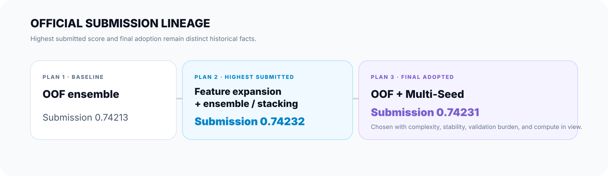
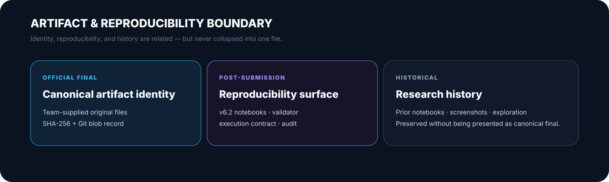

<picture>
  <source media="(max-width: 640px)" srcset="./docs/assets/readme/hero-mobile.svg" />
  
</picture>

<h1 align="center">🧬 Fertility PSP</h1>

  <strong>대회 제공 난임 시술 데이터 기반 임신 성공 여부 예측 연구</strong> 
  Official project SSOT · structural missingness · OOF validation · reproducible model lineage

  LG Aimers 6기 Phase2 · <a href="https://dacon.io/competitions/official/236452">DACON 공식 대회</a> · ROC-AUC

## Start Here

이 저장소는 nanimnoworry의 **Official project SSOT**입니다.

- [Model lineage](docs/model_lineage.md) — 공식 결과와 post-submission 계보 분리
- [Final submission manifest](deliverables/final_submission/MANIFEST.md) — canonical artifact identity
- [Public Notebook sanitation](docs/PUBLIC_NOTEBOOK_SANITIZATION.md) — source/current blob provenance

Organization 전체 맥락은 [nanimnoworry](https://github.com/nanimnoworry)에서 확인할 수 있습니다.

## Official Result

<picture>
  <source media="(max-width: 640px)" srcset="./docs/assets/readme/official-lineage-mobile.svg" />
  
</picture>

- **Highest submitted AUC:** 2안 · **0.74232**
- **Final adopted submission model:** 3안 · **0.74231**

3안 채택에는 모델 복잡도 · 검증 부담 · seed 변동성 · 추론 비용 · 운영 단순성이 함께 고려되었습니다.

<strong>1안·2안·3안 발표 기준 수치</strong>

- **1안** — OOF boosting/ensemble baseline · 내부 OOF ≈ 0.74058 · 제출 0.74213
- **2안** — feature 확장 + weighted / stacking · 내부 OOF ≈ 0.74088 · 제출 **0.74232**
- **3안** — OOF + Multi-Seed · 내부 OOF ≈ 0.74060 · 제출 0.74231 · **최종 채택**

실험안별 split · seed · 전처리 조건이 달라 OOF의 미세 차이를 직접 순위화하지 않습니다.

## Research Approach

구조적 결측을 시술 맥락과 함께 해석하고, domain-aware feature engineering과 K-Fold OOF를 중심으로 CatBoost · LightGBM · XGBoost 및 ensemble을 비교했습니다.

<strong>연구 방법 상세</strong>

- **Structural missingness** — IVF·DI 과정 차이에 따른 비해당 가능성과 일반 결측을 구분
- **Feature engineering** — 연령, 시술 유형, 난자/배아 수, 이식 시점, 기증자 정보, 과거 시술 이력과 조합·비율·missing indicator
- **OOF-first validation** — split · seed · feature contract가 다른 결과를 같은 조건처럼 취급하지 않음
- **Ensemble diversity** — Weighted · Rank · Multi-Seed · Stacking 비교, Rank 계열은 LogLoss와 분리해 해석

## Artifact & Reproducibility Boundary

<picture>
  <source media="(max-width: 640px)" srcset="./docs/assets/readme/artifact-boundary-mobile.svg" />
  
</picture>

- **Official final** — 실제 제출·발표 원본 identity를 hash로 기록
- **Post-submission** — 재현성 · 실행 구조 · literature merge · audit
- **Historical** — 과거 Notebook과 탐색 기록
- **Private follow-up** — planB 후속 연구는 공식 발표 결과와 별도 계보

Canonical raw artifact 전부를 public repository에 호스팅한다는 뜻은 아닙니다. 정확한 identity는 [MANIFEST.md](deliverables/final_submission/MANIFEST.md)를 기준으로 합니다.

## Reproducibility & Repository Guide

현재 default branch의 v6.2 계열은 **post-submission reproducibility asset**이며 canonical final submission artifact와 동일 파일이라고 주장하지 않습니다.

<strong>현재 실행 surface와 repository map</strong>

<pre>
00.Project_Fertility_PSP_v6.2.ipynb
00.Project_Fertility_PSP_v6.2_final_literature_merged.ipynb
scripts/validate_v6_2_notebook.py
reports/v6_2_notebook_audit.md
</pre>

- [post_submission/README.md](post_submission/README.md) — 제출 이후 재현성
- [historical/README.md](historical/README.md) — 과거 개발 자료
- [docs/repository_map.md](docs/repository_map.md) — 저장소 역할 지도

## Related Research

- [BS](https://github.com/nanimnoworry/BS) — Plan 3 연계 5-Fold OOF · Weighted / Rank Ensemble
- planB *(private)* — 후속 모델 연구 · bootstrap / slice 검증
- Research-Papers *(private)* — 임상·문헌 근거 · 발표자료 provenance

## Public Data & Scope

대회 원본 train.csv / test.csv는 public repository에 포함하지 않습니다. Public Notebook은 code-cell output과 execution count를 제거한 상태로 관리합니다.

**Scope boundary:** 해커톤·연구 결과이며 실제 의료 환경의 임상 검증, 진단 또는 의사결정 성능을 주장하지 않습니다. **Not a clinical diagnostic or medical decision system.**

---

### License and Rights

**Public view · no public reuse license.** 별도 서면 허가 없는 재사용 · 수정 · 재배포를 허용하지 않습니다.

[LICENSE](LICENSE) · [RIGHTS.md](RIGHTS.md) · [CONTRIBUTORS.md](CONTRIBUTORS.md)
