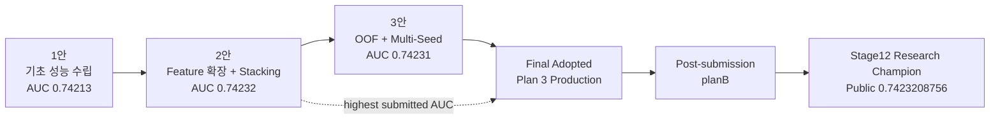

<div align="center">

# 🧬 Fertility PSP

### 난임 환자 대상 임신 성공 여부 예측 AI 프로젝트

<p>
  
  
  
  
  
</p>

**난임 시술 데이터의 구조적 결측과 임상 feature를 해석하고,  
OOF·앙상블·Multi-Seed 검증을 거쳐 최종 Production 전략을 선택한 팀 프로젝트입니다.**

</div>

---

> **Canonical history aligned · 2026-08-08**  
> 당시 팀이 실제 제출한 Notebook과 최종 발표자료를 기준으로 프로젝트 계보를 다시 맞췄습니다.  
> **최고 제출 AUC는 2안 `0.74232`, 최종 채택 Production 모델은 3안 `0.74231`입니다.**  
> 이후의 v6.x와 `planB` 연구는 중요한 후속 연구이지만 공식 최종 제출 역사와 분리해 보존합니다.

## 🏆 Final Result

| 항목 | 결과 |
|---|---:|
| 문제 | 난임 환자 임신 성공 여부 예측 |
| 평가 지표 | ROC-AUC — 높을수록 우수 |
| 최고 제출 모델 | **2안 — Feature 확장 + Ensemble / Stacking** |
| 최고 제출 AUC | **0.74232** |
| 최종 채택 모델 | **3안 — OOF + Multi-Seed 기반 일반화** |
| 최종 채택 AUC | **0.74231** |
| 최종 판단 | 성능·안정성·복잡도·운영 효율의 균형을 고려한 Production 선택 |

2안이 아주 미세하게 높은 제출 점수를 기록했지만, 최종 발표에서는 stacking 복잡도, leakage/overfitting 관리 부담, 검증 비용, 해석 난이도, latency·연산 자원과 seed 변동성을 함께 고려해 3안을 채택했습니다.

```text
Highest submitted AUC : Plan 2 — 0.74232
Final adopted model   : Plan 3 — 0.74231
```

---

## 🧬 Model Lineage



`planB`의 Stage12 champion은 공식 발표 이후의 후속 연구 계보입니다. 점수가 비슷하더라도 실험 계약과 artifact가 다르므로 공식 2안/3안과 동일 모델로 합치지 않습니다.

👉 자세한 계보: [`docs/model_lineage.md`](docs/model_lineage.md)

---

## 🔬 Core Research Insights

### Structural Missingness

DI 시술에서 배아·난자·이식 관련 정보가 대규모로 함께 비는 패턴을 단순 NaN이 아니라 **시술 과정 자체가 존재하지 않아 생기는 구조적 결측**으로 해석했습니다.

```text
IVF → embryo-related process exists
DI  → many embryo-related fields are structurally not applicable
```

원본 NaN의 의미를 보존하면서 필요한 missing flag를 병행하고, 이후 중요도가 낮거나 중복되는 flag는 OOF 성능을 확인하며 pruning 대상으로 다뤘습니다.

### Domain-aware Features

| Feature group | 예시 | 목적 |
|---|---|---|
| 연령 | ordinal, 38+/40+/43+ | 연령 구간별 성공률 차이 반영 |
| 시술 유형 | IVF / DI / ICSI / BLASTOCYST | 시술 구조 차이 반영 |
| 배아·난자 | 생성·이식·저장 배아 수, 난자 수 | 시술 과정의 핵심 수량 신호 |
| 비율 | fertilization / utilization | 과정 효율 표현 |
| 경과일 | 배아 이식 경과일 등 | 발달·이식 시점 정보 |
| 기증자 | 난자 출처, donor age interaction | 기증 난자 맥락 반영 |
| 과거 이력 | 시술·임신·출산 횟수 | 이전 치료 경험 반영 |
| 조합 | age × oocyte source 등 | 상호작용 신호 탐색 |

### OOF + Model Diversity

주요 모델은 `CatBoost`, `LightGBM`, `XGBoost`였으며, 단일 hold-out보다 K-Fold OOF를 중심으로 다음 조합을 비교했습니다.

```text
Weighted Ensemble
Rank Ensemble
Multi-Seed Ensemble
Stacking
```

Rank 계열은 ROC-AUC에는 유리할 수 있지만 확률값이 순위에 가까워져 LogLoss가 악화될 수 있다는 점도 함께 기록했습니다.

---

## 📊 Final Presentation Comparison

| 실험안 | 전략 | 내부 OOF AUC | 제출 AUC | 역할 |
|---|---|---:|---:|---|
| **1안** | boosting 비교 + OOF ensemble | ≈ `0.74058` | `0.74213` | 기초 성능 수립 |
| **2안** | richer feature + weighted / stacking | ≈ `0.74088` | **`0.74232`** | upper-bound benchmark |
| **3안** | OOF + Multi-Seed 안정화 | ≈ `0.74060` | `0.74231` | **Final Production** |

내부 OOF는 각 실험안의 검증 계약이 다를 수 있으므로 아주 작은 차이를 동일 조건의 직접 순위처럼 해석하지 않습니다.

---

## 📦 Canonical Final Artifacts

2026-08-08에 팀이 직접 제공한 실제 최종 제출 세트의 SHA-256과 Git blob identity를 별도로 기록했습니다.

👉 [`deliverables/final_submission/MANIFEST.md`](deliverables/final_submission/MANIFEST.md)

대표 파일:

```text
00.Project_Fertility_PSP_v5.ipynb
01_EDA_basic.ipynb
02_preprocessing_baseline.ipynb
03_rank1_strategy_local.ipynb
04_modeling_AUC_v3.ipynb
(예측모델_결과물)_조안_Project_Fertility_PSP_v5.ipynb
(발표자료)난임_환자_대상_임신_성공_여부_예측_AI_프로젝트-v4.pdf
```

### 동일 파일명 주의

GitHub에 과거부터 존재하던 `00.Project_Fertility_PSP_v5.ipynb`는 현재 다음 위치에 historical artifact로 보존합니다.

```text
historical/notebooks/00.Project_Fertility_PSP_v5.ipynb
Git blob: e6eec0a6512bfa20fca2b9a4eaf700d1b5cdad87
```

팀이 직접 제공한 canonical final artifact의 Git blob identity는 다음과 다릅니다.

```text
97b1d34ed14e7e5f07ba1d25a07dd7d310faaf23
```

따라서 같은 파일명이라는 이유로 같은 버전으로 취급하지 않습니다.

---

## 🗂️ Repository Structure

```text
PSP/
├── README.md
├── 00.Project_Fertility_PSP_v6.2.ipynb
├── 00.Project_Fertility_PSP_v6.2_final_literature_merged.ipynb
├── deliverables/
│   └── final_submission/       # canonical artifact identity
├── docs/                       # lineage · repository map · cleanup status
├── historical/
│   ├── notebooks/              # past development notebooks
│   └── assets/                 # legacy screenshots / figures
├── post_submission/            # v6.x의 역사적 역할 설명
├── reports/                    # audit reports
├── scripts/                    # validation scripts
└── tests/                      # notebook contract tests
```

과거 notebook과 이미지의 이동은 **기존 Git blob SHA를 그대로 재사용**해 수행했기 때문에 archive 정리 과정에서 파일 내용을 다시 저장하거나 변환하지 않았습니다.

👉 저장소 지도: [`docs/repository_map.md`](docs/repository_map.md)  
👉 정리 상태: [`docs/CLEANUP_STATUS.md`](docs/CLEANUP_STATUS.md)  
👉 Historical archive: [`historical/README.md`](historical/README.md)

---

## 🧪 Post-Submission v6.x

v6.2 계열은 실제 제출본을 대체하는 공식 final이 아니라 **사후 재현성·실행 구조 개선 자산**으로 보존합니다.

현재 `scripts/validate_v6_2_notebook.py`가 아래 exact root filename을 참조하므로 실행 계약을 깨뜨리지 않기 위해 이 notebook은 루트에 유지합니다.

```text
00.Project_Fertility_PSP_v6.2_final_literature_merged.ipynb
```

지원되는 흐름:

```text
smoke mode → synthetic fixture 기반 구조 검증
full mode  → 실제 train/test/sample_submission 기반 전체 실행
```

👉 [`post_submission/README.md`](post_submission/README.md)

---

## 🔗 Organization Repository Roles

| Repository | 역할 |
|---|---|
| **[`PSP`](https://github.com/nanimnoworry/PSP)** | **공식 프로젝트 허브 · 실제 제출/발표 SSOT** |
| [`planB`](https://github.com/nanimnoworry/planB) | 후속 연구 엔진 · OOF/bootstrap/slice-risk 기반 검증 |
| [`Research-Papers`](https://github.com/nanimnoworry/Research-Papers) | 임상·문헌 근거 · APA reference · 발표자료 archive |

### Recommended reading order

1. 이 README
2. [`docs/model_lineage.md`](docs/model_lineage.md)
3. [`deliverables/final_submission/MANIFEST.md`](deliverables/final_submission/MANIFEST.md)
4. [`historical/README.md`](historical/README.md)
5. [`planB/docs/RESEARCH_SCOPE.md`](https://github.com/nanimnoworry/planB/blob/main/docs/RESEARCH_SCOPE.md)
6. [`planB/docs/STAGE_INDEX.md`](https://github.com/nanimnoworry/planB/blob/main/docs/STAGE_INDEX.md)
7. [`Research-Papers`](https://github.com/nanimnoworry/Research-Papers)

---

## 📐 Research Record Policy

- Public / OOF / 발표상 최종 채택을 구분합니다.
- 파일명보다 hash identity를 우선합니다.
- 서로 다른 split·seed·전처리 계약의 작은 OOF 차이를 무리하게 직접 비교하지 않습니다.
- 공식 제출과 post-submission research를 섞지 않습니다.
- 과거 artifact는 삭제보다 archive와 역할 표기를 우선합니다.
- 모델 결과는 실제 의학적 판단이나 임상 의사결정을 대체하지 않습니다.

---

<div align="center">

### Final Adopted Model

**Plan 3 · OOF + Multi-Seed Generalization**

**Submission AUC 0.74231**

<sub>Highest submitted AUC: Plan 2 · 0.74232</sub>

</div>
