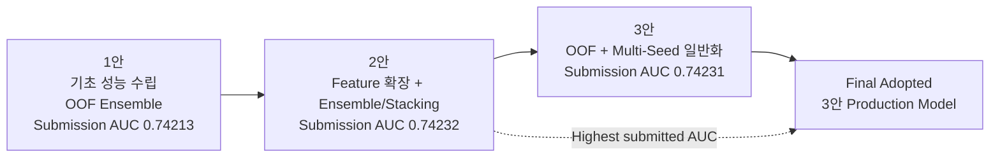
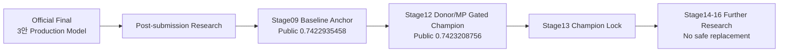

# Fertility PSP — Model Lineage

이 문서는 **실제 최종 발표/제출 계보**와 그 이후에 진행된 **후속 연구 계보**를 분리해 기록합니다.

핵심 원칙은 단순합니다.

> 최고 Public/제출 점수와 최종 채택 모델은 같은 개념이 아닐 수 있습니다.

---

## 1. 공식 최종 발표 계보



### 발표 기준 해석

| 구분 | 1안 | 2안 | 3안 |
|---|---|---|---|
| 역할 | 기초 성능 수립 / screening | 이론적 최고 성능 상한선 확인 | 실무·일반화 균형 |
| 내부 OOF AUC | ≈ `0.74058` | ≈ `0.74088` | ≈ `0.74060` |
| 제출 AUC | `0.74213` | **`0.74232`** | `0.74231` |
| 핵심 전략 | 주요 boosting 모델 + OOF ensemble | feature 확장 + weighted ensemble / stacking | OOF + Multi-Seed 기반 안정화 |
| 최종 역할 | baseline | highest-score benchmark | **Final Production Model** |

### 왜 3안을 최종 채택했나

발표자료는 2안의 AUC가 아주 미세하게 높다는 점을 인정하면서도, 최종 Production 모델은 3안으로 정리했습니다.

고려한 요소:

- stacking 구조 복잡도
- 학습 데이터 누수(leakage) 및 과적합 관리 부담
- 기반 모델부터 meta model까지 이어지는 검증 부담
- 모델별 예측 결합에 따른 해석 난이도
- 추론 latency와 연산 자원
- seed / split 변화에 따른 점수 변동 가능성
- 실제 서비스로 확장했을 때의 운영 단순성

따라서 공식 기록은 다음과 같이 구분합니다.

```text
Highest submitted AUC : 2안 — 0.74232
Final adopted model   : 3안 — 0.74231
```

---

## 2. 최종 제출 노트북에서 확인되는 핵심 연구 흐름

실제 제출본은 단순 모델 튜닝보다 **데이터 구조를 이해하고 그 구조를 feature와 validation에 반영하는 방식**이 중심이었습니다.

### Structural missingness

DI 시술에서 배아·난자·이식 관련 여러 변수가 함께 비는 현상을 단순 누락으로 보지 않고, 시술 구조 자체를 나타내는 신호로 해석했습니다.

```text
IVF → embryo-related process present
DI  → many embryo-related variables structurally not applicable
```

따라서 일괄 평균/0 대체 대신 원래 NaN 의미를 살리고 missing flag를 병행했습니다.

### Domain-aware feature engineering

대표적으로 다음 축이 사용되었습니다.

- 시술 당시 나이와 고연령 구간
- IVF / DI / ICSI 등 시술 유형
- 이식 배아 수, 생성 배아 수, 저장 배아 수
- 난자·배아 수량 비율
- 배아 이식 경과일
- 난자/정자 출처
- 기증 난자와 환자 연령의 상호작용
- 시술 이력 / 임신 이력 / 출산 이력
- 조합·비율·missing indicator

### OOF-first validation

단일 hold-out 점수만으로 최종 후보를 결정하지 않고 K-Fold OOF를 사용했습니다.

### Ensemble diversity

CatBoost, LightGBM, XGBoost를 단순히 개별 순위로 비교하는 데 그치지 않고 서로 다른 오류 패턴을 앙상블에 활용했습니다.

대표 연구 후보:

```text
3-Model Weighted Ensemble
Rank Ensemble
Multi-Seed Weighted Ensemble
Multi-Seed Rank Ensemble
Stacking
```

Rank 계열은 ROC-AUC에는 유리하지만 확률 calibration / LogLoss에는 불리할 수 있다는 점도 별도로 기록했습니다.

---

## 3. 후속 연구 계보 — planB

`nanimnoworry/planB`는 공식 최종 발표 이후에도 더 정밀한 연구를 이어간 저장소입니다.

이 계보는 **공식 최종 채택 모델을 덮어쓰지 않습니다.**



### Stage12 research champion

현재 `planB` 연구 기록상 핵심 champion은 다음 파일입니다.

```text
outputs/stage12_frozen_policy_candidate/submissions/
submission_stage12_frozen_donor_mp_gated_review.csv
```

기록된 결과:

```text
OOF AUC        0.7409379679
Public AUC     0.7423208756
vs old Public +0.0000273298
```

이 값은 공식 발표의 반올림 `0.74232`와 매우 가깝지만, **계보와 실험 계약이 다르므로 동일 모델이라고 단정하지 않습니다.**

Stage13 이후에는 이 research champion을 read-only anchor로 잠그고 Stage14~16에서 독립 후보를 탐색했으나, bootstrap / slice risk / decile shift / champion harm 등을 종합했을 때 교체할 만큼 안전한 후보는 없었다고 기록되어 있습니다.

---

## 4. 저장소 간 역할

| Repository | 역할 |
|---|---|
| [`nanimnoworry/PSP`](https://github.com/nanimnoworry/PSP) | **공식 프로젝트 허브 / 최종 제출·발표 SSOT** |
| [`nanimnoworry/planB`](https://github.com/nanimnoworry/planB) | 후속 실험·검증·research champion 기록 |
| [`nanimnoworry/Research-Papers`](https://github.com/nanimnoworry/Research-Papers) | 임상·문헌 근거와 발표자료 아카이브 |

---

## 5. 기록 규칙

1. **Final adopted**, **Highest submitted/Public**, **Best OOF**를 반드시 분리합니다.
2. 다른 split/seed/feature contract의 OOF를 소수점 차이만으로 직접 순위 비교하지 않습니다.
3. 실제 제출물은 hash로 식별합니다.
4. 후속 연구 결과가 더 좋아도 과거 공식 발표의 역사적 사실을 수정하지 않습니다.
5. 오래된 notebook을 삭제하기보다 `official / post-submission / historical` 역할을 명시합니다.
6. 최종 모델을 의료적 의사결정 도구로 과장하지 않습니다.

---

## 6. Canonical artifact identity

실제 팀 제출 파일의 SHA-256 / Git blob SHA는 다음 문서에서 관리합니다.

[`../deliverables/final_submission/MANIFEST.md`](../deliverables/final_submission/MANIFEST.md)
