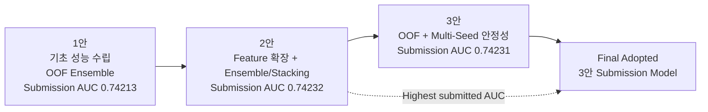
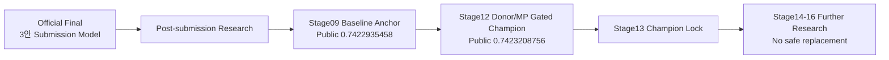

# Fertility PSP — Model Lineage

**Highest submitted AUC ≠ Final adopted model**  
공식 발표/제출 계보와 post-submission 연구 계보 분리.

---

## 1. 공식 최종 발표 계보



| 구분 | 1안 | 2안 | 3안 |
|---|---|---|---|
| 역할 | 기초 성능 / screening | 최고 제출 benchmark | 검증 안정성·복잡도 균형 |
| 내부 OOF AUC | ≈ `0.74058` | ≈ `0.74088` | ≈ `0.74060` |
| 제출 AUC | `0.74213` | **`0.74232`** | `0.74231` |
| 핵심 전략 | boosting + OOF ensemble | feature 확장 + weighted/stacking | OOF + Multi-Seed |
| 최종 역할 | baseline | highest-score benchmark | **Final Adopted Submission Model** |

**3안 채택 기준**
- stacking 구조 복잡도
- leakage/과적합 관리 부담
- base → meta model 검증 부담
- 예측 결합 해석 난이도
- 추론 latency · 연산 자원
- seed/split 변동성
- 운영 단순성

```text
Highest submitted AUC : 2안 — 0.74232
Final adopted model   : 3안 — 0.74231
```

---

## 2. 공식 제출 연구 축

### Structural Missingness

```text
IVF → embryo-related process present
DI  → many embryo-related variables structurally not applicable
```

DI의 배아·난자·이식 관련 동시 결측: 단순 누락과 분리.  
처리: 원 NaN 의미 보존 + missing flag.

### Domain-Aware Feature Engineering

- 시술 당시 연령 · 고연령 구간
- IVF / DI / ICSI
- 이식/생성/저장 배아 수
- 난자·배아 수량 비율
- 배아 이식 경과일
- 난자/정자 출처
- 기증 난자 × 환자 연령
- 시술/임신/출산 이력
- 조합·비율·missing indicator

### OOF-First Validation

단일 hold-out 대신 K-Fold OOF 중심.

### Ensemble Diversity

`CatBoost` · `LightGBM` · `XGBoost`

```text
3-Model Weighted Ensemble
Rank Ensemble
Multi-Seed Weighted Ensemble
Multi-Seed Rank Ensemble
Stacking
```

**Rank 계열:** ROC-AUC 이점 가능 · calibration/LogLoss 별도 확인.

---

## 3. Post-Submission — planB

**공식 3안 final adopted submission model ≠ planB research champion**



### Stage12 Research Champion

```text
outputs/stage12_frozen_policy_candidate/submissions/
submission_stage12_frozen_donor_mp_gated_review.csv

OOF AUC        0.7409379679
Public AUC     0.7423208756
vs old Public +0.0000273298
```

공식 발표 반올림 `0.74232`와 수치상 근접하나 계보·실험 계약 분리. 동일 모델 판정 금지.

**Stage13:** champion read-only lock  
**Stage14–16:** bootstrap · slice risk · decile shift · champion harm 기준 대체 후보 없음

---

## 4. Repository Roles

| Repository | 역할 |
|---|---|
| [`nanimnoworry/PSP`](https://github.com/nanimnoworry/PSP) | **공식 프로젝트 허브 · 최종 제출/발표 SSOT** |
| `nanimnoworry/planB` | 후속 실험 · 검증 · research champion |
| `nanimnoworry/Research-Papers` | 임상·문헌 근거 · 발표자료 |

---

## 5. Record Rules

1. **Final adopted / Highest submitted or Public / Best OOF** 분리
2. split · seed · feature contract가 다른 OOF 직접 순위화 금지
3. 실제 제출물은 hash로 식별
4. post-submission 성능이 공식 발표의 역사적 사실을 소급 변경하지 않음
5. `official / post-submission / historical` 역할 분리
6. 임상 의사결정 성능으로 과장 금지

---

## 6. Canonical Artifact Identity

[`../deliverables/final_submission/MANIFEST.md`](../deliverables/final_submission/MANIFEST.md)
